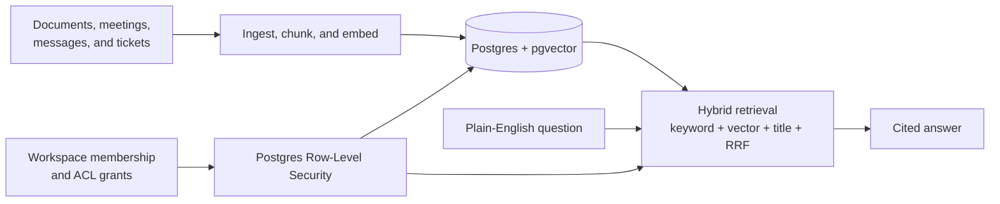

# CompanyBrain

**A multi-tenant RAG knowledge platform for teams.** CompanyBrain turns documents, meetings,
messages, and tickets into a shared knowledge base that people can search in plain English. Every
answer is grounded in retrieved source chunks and returned with citations; every result is scoped to
the caller's workspace and permissions.

## Why it exists

Teams accumulate decisions across documents and tools, then lose time locating the one discussion
that answers a question. CompanyBrain is designed to make that knowledge searchable without turning
one team's data into another team's search result.



## What is built

- **Hybrid retrieval:** keyword AND/OR, pgvector HNSW cosine similarity, and title-match candidates
  are fused with weighted Reciprocal Rank Fusion in a single SQL statement.
- **Cited answers:** the answer pipeline receives retrieved evidence and returns citations tied to
  the source material.
- **Database-enforced tenancy:** Postgres Row-Level Security, workspace membership, and ACL overlap
  policies constrain content access. The application connects through a non-`BYPASSRLS` role, so
  tenant isolation is enforced by the database rather than a best-effort application filter.
- **Derived knowledge:** document links/backlinks and facts are extracted through resumable,
  workspace-scoped background phases with checkpoints, locks, and transactional AI-spend ledgers.
- **Permission-preserving ingestion:** Nango provides the connector layer; Google Drive is the first
  integrated source alongside direct text and file upload.

## Evaluation: LongMemEval-S

[LongMemEval-S](https://huggingface.co/datasets/xiaowu0162/longmemeval) is a public benchmark for
long-term conversational memory. Each question is evaluated against dozens of conversation sessions;
the system must retrieve the session or sessions that contain the answer.

**Retrieval-only smoke result** — completed 2026-09-20 21:54 UTC, seeded 25-question run:

| Metric | Result | Meaning |
| --- | ---: | --- |
| Strict `recall_all@5` | **76.00%** | Every required session appeared in the top five retrieved chunks for 19/25 questions. |
| Any-session recall@5 | 92.00% | At least one required session appeared for 23/25 questions. |
| Evidence recall@5 | 83.33% | Fraction of all required session evidence recovered. |
| p50 / p95 search latency | 4.080s / 6.951s | Search time after ingestion, not corpus import time. |
| Degraded retrievals / scored failures | 0 / 0 | No query required a fallback or was silently dropped. |

This is a **completed 25-question smoke result**, not a final 500-question benchmark claim. A future
full run will replace this callout with its reproducible 500-question result. It measures retrieval
evidence only, not LLM-generated answer quality.

### Evaluation configuration

- Dataset: published `longmemeval_s` split, SHA-256 pinned by the runner
- Retrieval: CompanyBrain's default baseline, top 5 chunks
- Embeddings: direct OpenAI `text-embedding-3-small` at 1536 dimensions
- Disabled for this comparison: reranking, query expansion, and retrieval-knob overrides
- Isolation: one RLS-scoped workspace per benchmark question
- Spend protection: a fail-closed, campaign-wide embedding budget capped at $10

## Run locally

### 1. Start the application

**Prerequisites:** Bun, a Supabase project with pgvector, an OpenAI API key for embeddings, and an
OpenRouter API key for generated answers and enrichment phases. See [`.env.example`](.env.example)
for the required connection strings and keys.

```bash
git clone https://github.com/TaherPanbiharwala/CompanyBrain.git
cd CompanyBrain
cp .env.example .env
# Fill in the three Supabase connection strings, app-role passwords, and API keys.

bun install
bun run migrate
bun run doctor
bun run dev
```

Open `http://localhost:3000`. For Google OAuth configuration and a local development-login path,
see [the authentication setup guide](docs/auth-setup.md).

### 2. Reproduce the LongMemEval-S evaluation

Download the published `longmemeval_s` file first. The runner verifies its SHA-256 and validates all
500 cases before it sends a provider request.

```bash
# Validate the dataset and estimate embedding spend without calling Supabase or OpenAI.
bun run eval:longmemeval \
  --path /absolute/path/to/longmemeval_s \
  --dry-run

# Run a deterministic 25-question smoke evaluation.
bun run eval:longmemeval \
  --path /absolute/path/to/longmemeval_s \
  --sample 25 \
  --sample-seed 42 \
  --max-embed-usd 10
```

The runner prints a campaign ID. If a network interruption occurs, resume the same campaign instead
of starting over:

```bash
bun run eval:longmemeval \
  --path /absolute/path/to/longmemeval_s \
  --sample 25 \
  --sample-seed 42 \
  --max-embed-usd 10 \
  --resume <campaign-id>
```

Benchmark runs require a clean Git checkout so every report records an immutable code revision.
Checkpoints and JSONL/Markdown reports are written below ignored `eval/runs/<campaign-id>/` paths.

## Learn more

- [Authentication setup](docs/auth-setup.md)
- [Retrieval and answer-quality evaluation](docs/eval-rag.md)
- [Pipeline roadmap](docs/pipeline-roadmap.md)
- [Architecture and engineering decisions](DECISIONS.md)
- [Upstream attribution notice](NOTICE)
